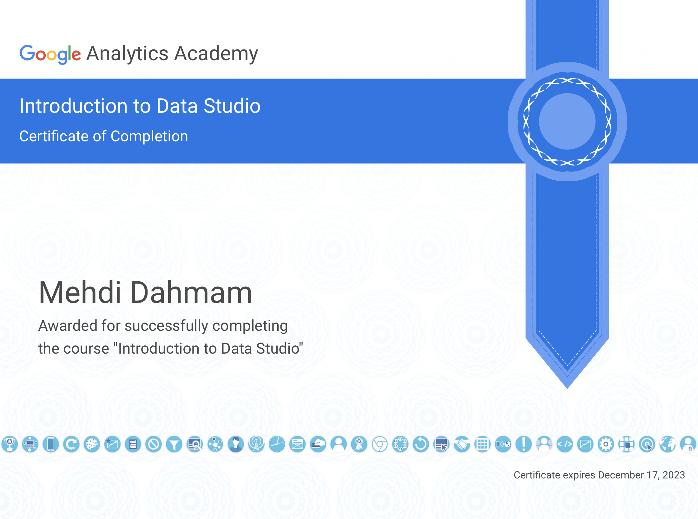

# Rapport Projet BI - Utilisateur et session dans le Google Merchandise Store

[Mon dashboard](https://datastudio.google.com/s/g5lRJuK2JO8)

## Pourquoi j'ai choisis ces données

J'ai suivie un tutoriel qui proposait l'utilisation des données, via Google Analytics, du Google Merchandise Store.
Après ce tutoriel il était intéressant, à mon sens, de relever et de mettre en avant, les informations concernant les utilisateurs et leurs rapport à la session.
C'est alors autour de ces deux variables que j'ai construit mon dashboard.

## Démarche

En commençant par le nombre de session total, qui est une valeur importante, puis d'autres valeurs liée directement à elle : le nombre de sessions par utilisateur et la durée moyenne d'une session.

Ces informations servent d'introduction et permettent de faire le haut de l'entonnoir et de préparer celui qui regarde le dashboard.

Je rentre ensuite dans le détail en utilisant la donnée "type d'utilisateur" qui coupe les **nouveaux** utilisateurs et ceux qui sont **revenue**.

Cette première distinction est fondamentale, et me permet de le mettre en rapport direct avec le chiffre d'affaire : ceux qui reviennent me font ils gagner plus d'argent, et quand ?

Je peux donc me permettre de rentrer plus en détail, et faire la deuxième distinction importante de mes utilisateurs : leur catégorie d'affinité.

Sont ils plus technophile, aiment ils le lifestyle, préfèrent ils voyager ? Ainsi je pourrais savoir plus en détail qui achète chez moi, complété par les informations précédentes.

Toutes les informations ont pour but de converger, dans le cadre d'une lecture complète, sur le dernier tableau.

Ce dernier tableau à le niveau de détail le plus élevé du dashboard et, bien qu'il utilise encore quelques couleur et graphique, va mettre en lien plusieurs donnée, dont une importante, le taux de conversion par objectif.

## Detail d'utilisation

Concernant l'utilisation, il peut être visualisé de manière global pour savoir le nombre de session créée et le taux de nouvel utilisateur, mais aussi de manière détaillé du haut vers le bas et de la gauche vers la droite.

Toutes les données se basent sur le dernier trimestre et se change grâce au sélecteur de plage dans le haut droit du dashboard.

En survolant l'anneau des utilisateurs vous pourrez y observer le chiffre d'affaire total produit.
En survolant le graphique à la droite de l'anneau vous pourrez y observer le chiffre d'affaire explicite.
Concernant le tableau, vous pourrez, grâce aux flêches, voir les autres catégories d'affinités.

## Certificat

## Sources et bibliographie

[Tutoriel](https://www.youtube.com/watch?v=4xmyomDMnnc&feature=youtu.be) : cette vidéo YouTube m'a appris les base et comment on peut agencer un dashboard pour qu'il soit cohérent visuellement.

[Article](https://www.geckoboard.com/best-practice/data-visualization-tips/) : cet article lui m'a appris à proportionné et organisé mon dashboard ; c'est grâce à lui que j'ai eu l'idée de mettre en place un stratégie d'entonnoir, allant de la variable la plus général à la plus détaillé. C'est aussi grâce à lui que j'ai eu l'idée d'utiliser un gris pour un certain nombre de variable pour montrer la dépendance à une autre.
